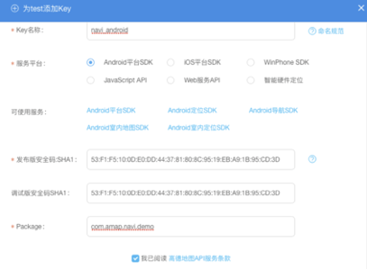
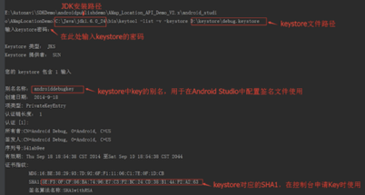
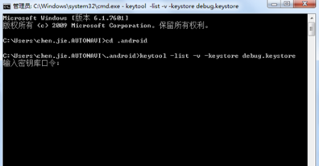
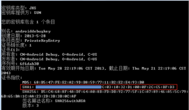

### 地图功能模块

#### **简介：**

地图功能模块是用JAVA语言编写的，可以实现地图手势交互，绘制点，获取POI数据和路线规划等功能。模块主要通过调用高德地图API实现，本文将从获取key，显示地图及定位，手势交互，绘制点，获取POI数据和路线规划等方面进行介绍。

#### **特性：**

**POI数据获取**

**绘制点及自定义infowindow**

**路线规划**

#### **安装及快速开始：**

在Android studio里打开本项目后，需要用户在高德官网http://lbs.amap.com/ 申请key.

请按照以下步骤获取key:

1、进入控制台，创建一个新应用。如果之前已经创建过应用，可直接跳过这个步骤

2、 在创建的应用上点击”添加新Key”按钮，在弹出的对话框中，依次：输入应用名名称，选择绑定的服务为“Android平台SDK”，输入发布版安全码 SHA1、调试版安全码 SHA1、以及 Package，如下图所示：

在阅读完高德地图API服务条款后，勾选此选项，点击“提交”，完成 Key 的申请，此时您可以在所创建的应用下面看到刚申请的 Key 了。

调试版本（debug）和发布版本（release）下的 SHA1 值是不同的，发布 apk 时需要根据发布 apk 对应的 keystore 重新配置 Key。

获取调试版本 SHA1 需要根据不同的开发工具，分别参考 通过Eclipse获取SHA1 和 通过Android Studio获取SHA1。 获取发布版本下 SHA1 的方法请参考 使用 keytool（jdk自带工具）获取SHA1。 第一步、打开 Android Studio 的 Terminal 工具。

第二步、输入命令：keytool -v -list -keystore keystone文件路径。

第三步、输入 Keystore 密码

使用 keytool（jdk自带工具）获取 SHA1

1、运行进入控制台。

2、在弹出的控制台窗口中输入 cd .android 定位到 .android 文件夹。

3.继续在控制台输入命令。

调试版本使用 debug.keystore，命令为：keytool -list -v -keystore debug.keystore。 发布版本使用 apk 对应的 keystore，命令为：keytool -list -v -keystore apk 的 kenstore。

如下所示：

提示输入密钥库密码，开发模式默认密码是 android，发布模式的密码是为 apk 的 keystore 设置的密码。输入密钥后回车（如果没设置密码，可直接回车），此时可在控制台显示的信息中获取 Sha1 值，如下图所示：

说明：keystore 文件为 Android 签名证书文件。

打开 Android 项目的 AndroidManifest.xml 配置文件，填写key的name和value,如下图所示：

也请检查 build.gradle 文件的 applicationid 属性是否与上文提到的 package 属性一致，如果不一致会导致 INVALID_USER_SCODE，调整一致

#### **API介绍：**

| 序列号 | 功能名称 | 使用的API内容                                                | 解释                                                         | 其他                                                         |
| ------ | -------- | ------------------------------------------------------------ | ------------------------------------------------------------ | ------------------------------------------------------------ |
| 1      | 显示地图 | Map View对象 AMap对象                                        | AMap 类是地图的控制器类，用来操作地图。AMap 是地图 SDK 最重要的核心类，在 MapView 对象初始化完毕之后，构造 AMap 对象 |                                                              |
| 2      | 定位功能 | MyLocationStyle类 OnLocationChangedListener类                | 展现模式：myLocationType() 是否显示: showMyLocation(boolean visible) |                                                              |
| 3      | 手势交互 | UiSetting类                                                  | 通过 UiSetting 类提供的接口来控制手势的开关。                |                                                              |
| 4      | 绘制点   | MarkerOptions类 .OnMarkerClickListener类  接口InfoWindowAdapter | 自定义Marker:markerOption.position(Constants.XIAN);     markerOption.title("西安市").snippet("西安市：34.341568, 108.940174"); Marker点击事件： public boolean onMarkerClick(Marker marker) 自定义 InfoWindow， 实现InfoWindowAdapter  View getInfoWindow(Marker marker) View getInfoContents(Marker marker) | 地图 SDK 提供的点标记功能包含两大部分，一部分是点（俗称 Marker）、另一部分是浮于点上方的信息窗体（俗称 InfoWindow）。同时，SDK 对 Marker 和 InfoWindow 封装了大量的触发事件，例如点击事件、长按事件、拖拽事件。 |
| 5      | POI搜索  | OnPoiSearchListener 类 PoiSearch.Query对象 PoiSearch类       | 设置搜索条件：PoiSearch.Query(String query, String ctgr, String city) 发送请求： searchPOIAsyn() 解析返回的结果：public void onPoiSearched(PoiResult result, int rCode) | 实现了关键字检索POI                                          |
| 6      | 路线规划 | RouteSearch类                                                | 设置搜索参数：WalkRouteQuery(RouteSearch.FromAndTo fromAndTo, int mode) 规划路径计算：calculateWalkRouteAsyn(WalkRouteQuery query)  解析result获取算路结果：public void onWalkRouteSearched(WalkRouteResult result, int rCode) | 弹出提交成功的带有动画的提示窗                               |